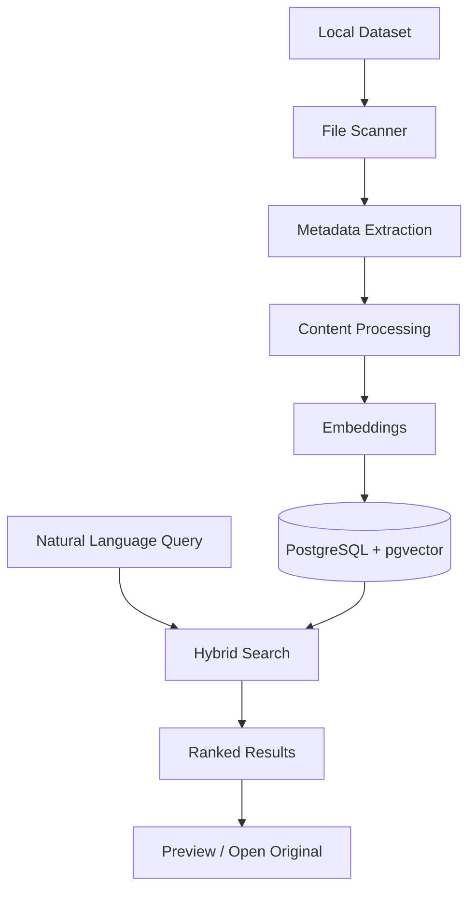

# AI-Powered Digital Asset Management

A local Digital Asset Management system for mixed media collections (images, videos, PDFs).
Point it at a dataset directory, index everything once, and find assets with
natural-language queries — ranked by relevance, filterable by file type, and
previewable in the browser.

## Overview

Organizations accumulate large collections of images, videos, brochures, and other
marketing assets across nested folders with unclear filenames (`IMG_0421.jpg`,
`final_v2.mp4`). Finding a particular asset becomes difficult when users don't know
the exact filename or location.

This application solves that problem locally:

- It **ingests** a configured dataset directory containing images, videos, and PDFs.
- It **understands content** — actual image pixels, sampled video frames, and
  extracted PDF text — by encoding each asset into a 512-dimensional embedding
  stored in PostgreSQL + pgvector.
- It **retrieves semantically**: users type natural-language queries
  (e.g. "a lush green forest landscape") and get ranked results, even when no
  filename contains the query terms.

Semantic/content-based search is useful here precisely because filenames don't
describe content. A keyword search for `forest` can never find `landscape.jpg`;
a visual embedding can, because the query and the image pixels live in one shared
similarity space. Lexical matching is kept alongside semantics (hybrid ranking) so
exact filename hits still win while visual similarity decides everything else.

## ✨ Features

- Image (`.jpg`, `.jpeg`, `.png`, `.webp`), video (`.mp4`, `.mov`, `.mkv`, `.webm`),
  and PDF ingestion
- Recursive folder scanning (nested subfolders; hidden dotfiles ignored)
- Metadata extraction (dimensions via Pillow, duration via ffprobe, size, MIME type,
  filesystem timestamps)
- Content-based AI understanding (image pixels, sampled video frames, PDF text)
- Local OpenCLIP ViT-B/32 512-d embeddings with a dependency-free deterministic
  fallback (`EMBEDDING_PROVIDER=auto|local|deterministic`)
- Natural-language semantic search over one shared query/asset embedding space
- Hybrid lexical + semantic ranking (per-asset-type z-score normalization, lexical
  rescue of exact matches)
- PostgreSQL + pgvector storage (`assets` table, `vector(512)`)
- File-type filters (All / Images / Videos / PDFs)
- Image / video-player / PDF preview modal with metadata and extracted-text excerpt
- Original file location shown, copyable, and openable on the server host
- Indexing status/progress (`POST /api/index`, `GET /api/index/status`)
- Duplicate detection via SHA-256 content hashing
- Incremental indexing (unchanged files skipped, changed files reprocessed)
- Unsupported-file handling (`status=unsupported`, never fatal)
- Failed-processing handling (per-asset `failed` status with error message; the job
  always finishes)
- Persistent indexed data (re-runs and restarts keep all rows and embeddings)
- Fully local execution (no cloud services, no auth, no background queues; models
  are never downloaded automatically)

## 🎥 Demo

### [▶️ Watch the Demo on Loom](https://www.loom.com/share/691f285bb9244b59a9cbef72eedd89a3)

The demo shows:

- Dataset indexing
- Processing status
- Natural-language semantic search
- Ranked results
- File-type filtering
- Image / video / PDF preview

## 🏗️ Architecture



Component responsibilities:

- **File Scanner** (`backend/app/services/scanner.py`) — recursive walk, extension
  classification, SHA-256 hashing, Pillow/ffprobe metadata, idempotent upsert keyed
  by `relative_path`, duplicate detection, per-file failure isolation.
- **Metadata Extraction** — width/height (Pillow), duration (ffprobe, best effort),
  file size, MIME type, filesystem timestamps. Missing/unreadable metadata never
  fails a file.
- **Content Processing** (`ai.py`, `video.py`) — deterministic description templates
  by default (optional already-present Ollama override, never auto-pulls); PDF text
  via pypdf (truncated at 8000 chars); video frames via ffmpeg into a temp dir that
  is always deleted.
- **Embeddings** (`embeddings.py`) — provider abstraction (`auto|local|deterministic`),
  512-d L2-normalized vectors; images from actual pixels, videos from mean-pooled
  sampled-frame embeddings, PDFs from extracted text, queries via `embed_text()`.
- **PostgreSQL + pgvector** — one `assets` row per dataset file (identity, hash,
  description/text, `vector(512)` embedding, status workflow, media metadata).
  Schema owned by Alembic migrations.
- **Hybrid Search** (`search.py`) — `LEXICAL_WEIGHT * lexical + semantic_z` fused
  relevance over pgvector cosine candidates, with lexical rescue and a keyword
  fallback when nothing is embedded.
- **Preview / Open Original** (`files.py`, `PreviewModal.tsx`) — ID-only lookup,
  dataset-confined serving, inline image/video/PDF rendering, copyable original path
  plus shell-free OS open.

Further detail: [`docs/architecture.md`](docs/architecture.md),
[`docs/api.md`](docs/api.md).

## 🔄 End-to-End Flow

1. User places media inside the configured local dataset directory
   (`data/images/`, `data/videos/`, `data/documents/`).
2. Application recursively scans the directory (nested folders OK, dotfiles ignored).
3. Metadata is extracted (dimensions, duration, size, MIME type, timestamps).
4. Images are analyzed using **actual image pixels** (OpenCLIP `encode_image`).
5. Videos are processed using **sampled frames** (~1 frame per 10 s, max 6 frames),
   not every frame.
6. PDFs have their **text extracted** via pypdf (truncated at 8000 characters).
7. Content embeddings (512-d, L2-normalized) are generated with the same provider
   used for queries.
8. Metadata and embeddings are persisted in PostgreSQL/pgvector.
9. User enters a natural-language query.
10. Search performs semantic + lexical retrieval (hybrid ranking).
11. Results are ranked by fused relevance score.
12. User can filter by file type, preview, and locate/open the original asset.

The system matches on the **actual content of assets** — pixels, frames, extracted
text — not filenames. A query like `forest` retrieves `landscape.jpg` even though
neither its filename nor its path contains the word "forest" (see
[Semantic Search](#-semantic-search) and [Search Evaluation](#-search-evaluation)).

## 🧠 AI / Content Understanding

The embedding provider is selected via `EMBEDDING_PROVIDER=auto|local|deterministic`
(default `auto`): the local 512-d OpenCLIP model when its packages and cached
weights are already present, otherwise a hashed bag-of-words deterministic fallback.
Models are never downloaded — offline flags are forced during load. Every embedding
path degrades gracefully to text rather than failing an asset.

### Images

- Actual image pixels are loaded with Pillow and encoded with the OpenCLIP
  ViT-B/32 image encoder (`encode_image` + model preprocessing), L2-normalized.
- Embedding dimensionality is **512** (`EMBEDDING_DIMENSION = 512` in
  `backend/app/models/asset.py`, matching the `vector(512)` pgvector column and
  CLIP ViT-B/32's joint image-text space).
- Because text queries are encoded with the same model's text tower into the same
  space, cross-modal retrieval works: a text query matches images by visual content
  without any shared words.

### Videos

- Container metadata and frames come from the **ffmpeg/ffprobe** system binaries
  (required on `PATH`; not Python dependencies). Without them, videos are marked
  `failed` with a clear message and the job continues.
- Frames are sampled at approximately one frame every 10 seconds
  (`FRAME_INTERVAL_SECONDS = 10.0`), capped at **6 frames max** (`MAX_FRAMES = 6`),
  so long videos stay cheap. Frames go to a temporary directory that is always
  removed; only the combined description and its embedding are stored.
- Each sampled frame is embedded and the frame embeddings are mean-pooled into one
  512-d video vector; per-frame extraction errors are skipped individually.
- Sampling is a deliberate cost control: embedding every frame of a long video
  would be orders of magnitude more expensive for rapidly diminishing retrieval value.

### PDFs

- Text is extracted with **pypdf** (pure Python), truncated at 8000 characters.
  Unreadable PDFs keep `extracted_text = NULL` with a "No extractable text found."
  description instead of failing; scanned/image-only PDFs have no OCR, so
  image-only pages yield no text and are searchable only by filename/description.
- The extracted/searchable text is embedded with `embed_text()` into the same
  512-d space, enabling semantic topic retrieval over document content.
- PDFs render in the preview modal via an embedded browser viewer (plus "open in
  new tab").

## 🔎 Semantic Search

`GET /api/search?q=...&limit=20&file_type=image|video|pdf` (`q`: 1–500 chars,
`limit`: 1–100):

- **Natural-language queries** are embedded with the same provider used at index
  time (`embed_text()`), so queries and stored vectors share one space.
- **Semantic similarity** comes from pgvector cosine distance over rows with
  non-null embeddings.
- **Lexical matching** scores exact-filename, filename-term, and
  description/path/extracted-text term matches (filler words ignored).
- **Hybrid ranking** fuses them as `LEXICAL_WEIGHT (4.0) * lexical + semantic_z`,
  so exact matches (e.g. `dog` → `dog.jpg`) dominate while pure visual similarity
  decides when nothing matches lexically (e.g. `forest` → `landscape.jpg`).
- **Lexical rescue**: candidates matching lexically are pulled into the pool even
  past the raw-distance cutoff, so exact hits are never lost.
- **Modality (per-type z-score) normalization**: raw CLIP text–text scores (PDFs,
  ~0.55–0.85) live far above correct text–image scores (~0.15–0.30); sorting raw
  cosine buries relevant images under unrelated PDFs, so similarities are
  z-score-normalized per asset type before fusion.
- **Relevance ordering**: per-result `score` is the fused relevance (higher is
  better, never NaN); `method` is `vector`, or a keyword fallback label when nothing
  is embedded. Rows with missing/degenerate embeddings never outrank scored rows.
- **File-type filtering** maps directly to the `file_type` parameter (the UI offers
  All / Images / Videos / PDFs) and composes with ranking.

Hybrid ranking matters for mixed collections because each modality scores on a
different scale: without normalization and lexical anchoring, PDFs would always
crowd out visually correct images and videos.

Verified live examples against the real `data/` corpus (CLIP provider + hybrid
ranking; verbatim fused scores from `docs/search-evaluation.md`):

- `dog` → `images/dog.jpg` first (+6.21) — exact filename + semantic agreement.
- `forest` → `images/landscape.jpg` first (+1.65) — no filename/path contains
  "forest": pure visual semantic retrieval.
- `a lush green forest landscape` → `images/landscape.jpg` first (+4.77).

> Note: `person` and `car` exist as assets (`images/person.jpg`, `images/car.jpg`)
> but no `person`/`car` query runs are recorded in `docs/search-evaluation.md`, so
> no results are claimed for them here.

## 📊 Search Evaluation

The assignment requires at least 10 search evaluations. Full report:
[`docs/search-evaluation.md`](docs/search-evaluation.md).

**How it was performed:** backend started locally, `POST /api/index` on the real
`data/` directory, then `GET /api/search?q=<query>&limit=5` per query with verbatim
top results, scores, and method recorded. Verdicts: **SUCCESS** (expected asset
top-ranked with discriminating score, or correctly weak for no-match queries),
**PARTIAL** (right asset, weak score / wrong reason), **FAILED** (expected asset
missing or wrong asset leading).

Summary table (12 queries — the deterministic-fallback baseline era; the addendum
re-verifies `dog` / `forest` / `a lush green forest landscape` under CLIP + hybrid
ranking as quoted above):

| # | Query | Expected Assets | Observed Result | Relevance |
|---|---|---|---|---|
| 1 | `sample png image` | `images/sample.png` | #1 at 0.5455, clear margin | SUCCESS |
| 2 | `nested photo` | `images/nested/nested.jpg` | #1 at 0.3873, rest 0.0 | SUCCESS |
| 3 | `blue picture` | `images/sample.png` (steel-blue) | Three-way 0.0 tie, no signal | FAILED |
| 4 | `green landscape photo` | `images/nested/nested.jpg` (green) | All rows 0.0 | FAILED |
| 5 | `woman standing with a cat` | No match (nothing like it) | Max 0.085, nothing convincing | SUCCESS (correct rejection) |
| 6 | `customer testimonial video` | `videos/sample.mp4` | Video unretrievable (no embedding); unrelated image led at 0.44 | FAILED |
| 7 | `PDF about machine learning` | `documents/sample.pdf` | #1 at 0.1118 via filename token only | PARTIAL |
| 8 | `sample document pdf` | `documents/sample.pdf` | #1 at 0.6455, strong margin | SUCCESS |
| 9 | `video clip mp4` | `videos/sample.mp4` | Video unretrievable; PDF led at 0.52 | FAILED |
| 10 | `sample` | `sample.png` + `sample.pdf` | Top-2 at 0.6708 / 0.5669 | SUCCESS |
| 11 | `notes readme` | `readme.txt` | Unsupported file invisible; weak noise hits | FAILED |
| 12 | `quantum database replication` | No match (control) | Exact-zero sweep | SUCCESS (correct rejection) |

Totals: **6 successful, 1 partial, 5 failed.**

- **What worked well:** filename/token and cross-media keyword-style queries
  (Q1, Q2, Q8, Q10); both no-match controls correctly returned nothing strong
  (Q5, Q12); file-type filtering composes correctly with ranking
  (`q=sample&file_type=pdf` → only `sample.pdf`).
- **Where it performed poorly:** color/object/scene concepts under the deterministic
  fallback (Q3, Q4 — template descriptions carry no visual semantics); video queries
  when the only video failed processing without ffmpeg (Q6, Q9); unsupported files
  are invisible to vector search (Q11).
- **Dataset-caused limitations:** the baseline corpus was 4 synthetic placeholder
  files with template descriptions, so concept queries had no true positive by
  construction; hashed-bucket collisions scored up to ~0.52 for unrelated queries,
  so no score threshold separated hits from noise.

## 📁 Dataset

Actual local dataset (inspected file listing; `.gitkeep` placeholders excluded):

| Type | Count | Approx. Size |
|---|---:|---:|
| Images | 7 | 7.4 MB |
| Videos | 3 | 3.7 MB |
| PDFs | 3 | 93.7 MB |
| Unsupported | 1 (`readme.txt`) | 31 bytes |
| **Total** | **14** | **~104.8 MB (~0.10 GB)** |

Contents: `car.jpg`, `cat.jpg`, `dog.jpg`, `landscape.jpg`, `person.jpg`,
`sample.png`, `nested/nested.jpg`; `nature.mp4`, `person_talking.mp4`,
`sample.mp4` (2060-byte placeholder header, no real streams);
`fy-2025-budget-request-summary-updated.pdf` (~7.7 MB),
`nasa-ames-development-plan-dec-2002.pdf` (~86 MB), `sample.pdf` (34-byte minimal
PDF); `readme.txt` (unsupported). Expected local structure:

```text
data/
├── images/
├── videos/
└── documents/
```

Honest note on size: the evaluation dataset (~0.10 GB) is smaller than the
requested 5–10 GB. The core system was evaluated using this representative
mixed-media corpus (real photos, real videos, real multi-MB PDFs plus synthetic
edge-case files). The full media dataset is intentionally excluded from GitHub —
`data/images/*`, `data/videos/*`, `data/documents/*` are git-ignored (only
`.gitkeep` files are committed). The architecture is designed to handle larger
collections: incremental hash-based skipping, capped video frame sampling,
chunked SHA-256 hashing, per-asset failure isolation, and persistent state mean
re-indexing cost grows with *changed* files, not total files.

## ⚙️ Reliability and Incremental Indexing

### Duplicate Detection

Every scanned file gets a SHA-256 hex digest (`file_hash`, indexed, chunked reads
so large files never load fully into memory). Same content under a different path
keeps both rows; extras get `status=duplicate` and are skipped by all processing
paths — visible in listings/stats, never fatal, never crashing a job.

### Incremental Indexing

The scanner upserts keyed by `relative_path`. On re-run it compares content hashes:
unchanged `completed` rows keep their status, descriptions, and embeddings and are
counted as `skipped` (zero pending rows → processing phase is a no-op, outputs
byte-identical). Only new or changed files cost processing work.

### Changed Files

When an existing asset's content hash differs, its row is reset to `pending` with
stale `description`/`extracted_text`/`embedding` cleared, then reprocessed through
the normal pipeline.

### Unsupported Files

Any other extension (e.g. `.txt`) is recorded with `file_type=other`,
`status=unsupported`: visible in listings/stats, skipped by every processing path,
counted in summaries — never fatal. Unsupported rows have no embedding and are
therefore invisible to vector search (documented evaluation limitation, Q11).

### Failed Files

A corrupt image, missing ffprobe data, unreadable PDF, failed video, or embedding
error is recorded on that row as `status=failed` with `error_message` and
processing timestamps; the job always finishes and reports per-asset errors. A
missing physical file is detected up front and reported (404) instead of a blank
viewer. Deleted files are never auto-pruned — rows persist by design and stay
visible.

### AI/Model Failure

Implemented fallback/error behavior: the embedding provider degrades gracefully
(`auto` → deterministic hashed fallback; any image-encoder gap falls back to
text) and a provider error fails only that asset. The vision side uses
deterministic metadata templates by default; Ollama is consulted only when
`AI_PROVIDER=ollama` with an already-pulled model (the app only checks
`/api/tags`, never pulls). Missing ffmpeg/ffprobe marks videos `failed` with
"ffmpeg/ffprobe not available on this system; …". No single asset failure stops
indexing.

### Large Collections

Currently implemented cost controls: incremental processing (unchanged files
skipped), sampled video frames (≤6 per video), persistent state (embeddings kept
across runs; one-time `POST /api/process/reembed` after switching providers),
chunked hashing, per-asset failure isolation, and a 409 running-job guard.

**Currently implemented vs. future:** there are no background workers, queues, or
distributed infrastructure — `app/workers/__init__.py` is reserved/empty, indexing
progress is in-memory (resets on restart), and concurrent server workers don't
share the running-job guard. A persistent background job queue, multiple indexing
workers, resumable indexing, and richer progress tracking are explicitly
**future/production improvements**, not current functionality. No Redis, Celery,
Kafka, distributed workers, or async queues are claimed.

## 🗄️ Data Storage

PostgreSQL + pgvector, single `assets` table (`vector(512)` embedding column),
schema owned by Alembic migrations. One row per dataset file persists:

- filename, original path, relative path (unique lookup key)
- file type (`image|video|pdf|other`), MIME type, file size
- SHA-256 content hash
- filesystem timestamps (`created_at`, `modified_at`) plus processing/indexing
  timestamps (`processing_started_at`, `processing_completed_at`, `last_indexed_at`)
- processing status (`pending|processing|completed|failed|skipped|duplicate|unsupported`)
  and `error_message`
- description / content information, extracted text where applicable (PDFs)
- 512-d embedding (nullable until processed)
- media dimensions (`width`, `height`) and `duration_seconds` where applicable

## 🛠️ Technology Stack

| Layer | Technology |
|---|---|
| Frontend | React 19, TypeScript, Vite 8, Tailwind CSS 4 |
| Backend | Python, FastAPI, Uvicorn |
| ORM | SQLAlchemy 2 |
| Database | PostgreSQL (pgvector image `pgvector/pgvector:pg16` for the optional DB container) |
| Vector Search | pgvector (`vector(512)`, cosine distance) |
| Image Processing | Pillow |
| Video Processing | FFmpeg / ffprobe (system binaries on `PATH`) |
| PDF Processing | pypdf |
| Embeddings | OpenCLIP (`open_clip_torch`, ViT-B/32, optional/local-only) with deterministic hashed fallback |
| Migrations | Alembic |
| Config | pydantic-settings (`.env`) |
| Tests | pytest, httpx |

Every entry verified against `backend/requirements.txt`, `frontend/package.json`,
and the implementation (torch/`open_clip_torch` are optional and intentionally
absent from `requirements.txt` — the app works without them via the fallback).

## 🚀 Getting Started

### Prerequisites

- Python 3.13+
- Node.js 22+ with npm
- PostgreSQL with the pgvector extension installed and available (the app runs
  `CREATE EXTENSION IF NOT EXISTS vector` but cannot install the extension module
  itself)
- FFmpeg + ffprobe on `PATH` (for real video processing)
- Git

Docker is **not** required. (`docker-compose.yml` only runs PostgreSQL via the
`pgvector/pgvector:pg16` image as a convenience; the Python/Node steps are the
same either way. There is also a `scripts/start-db.bat` Windows helper.)

### 1. Clone Repository

```bash
git clone <repository-url>
cd ai-digital-asset-manager
```

### 2. Backend Setup

```bash
cd backend
python -m venv .venv
.venv\Scripts\activate        # Windows; use `source .venv/bin/activate` on Linux/macOS
pip install -r requirements.txt
copy .env.example .env        # then edit DATABASE_URL / DATASET_PATH if needed
```

Optional semantic embeddings (large one-time download): the CLIP provider engages
automatically when `torch`, `open_clip_torch`, and cached ViT-B/32 weights are
already present; otherwise the deterministic fallback is used with no changes:

```bash
pip install torch torchvision open_clip_torch
python -c "import open_clip; open_clip.create_model_and_transforms('ViT-B-32', pretrained='openai')"
```

`.env` configuration (see `backend/.env.example`): `DATABASE_URL` (default
PostgreSQL port 5432 — adjust if your server listens elsewhere), `BACKEND_HOST`,
`BACKEND_PORT`, `FRONTEND_URL`, `DATASET_PATH` (default `./data`),
`AI_PROVIDER`/`OLLAMA_URL`/`OLLAMA_MODEL` (optional vision override, never
auto-pulls), `EMBEDDING_PROVIDER` (`auto|local|deterministic`, default `auto`),
`LOCAL_EMBEDDING_MODEL` (default `clip-ViT-B-32`), `LOCAL_EMBEDDING_MODEL_PATH`
(optional explicit weights directory).

### 3. Database Setup

Create the PostgreSQL database (matching `DATABASE_URL`), ensure the server
provides the `vector` extension module, then:

```bash
alembic upgrade head
python -m app.database.init_db
```

`init_db` is a fail-fast connectivity/extension check.

### 4. Frontend Setup

```bash
cd frontend
npm install
copy .env.example .env         # VITE_API_URL=http://localhost:8000
npm run dev
```

### 5. Dataset Setup

Place media files under:

```text
data/images/
data/videos/
data/documents/
```

Nested subfolders work; hidden dotfiles are ignored. `DATASET_PATH` in
`backend/.env` overrides the location (default `./data`).

### 6. Run the Application

Backend (from `backend/`):

```bash
uvicorn app.main:app --reload --host 0.0.0.0 --port 8000
```

Frontend (from `frontend/`):

```bash
npm run dev
```

- Frontend: `http://localhost:5173`
- Backend: `http://localhost:8000` (health: `GET /api/health` →
  `{"status":"ok","service":"ai-digital-asset-manager"}`; interactive docs at
  `http://localhost:8000/docs`)

Demo flow: put files in `data/…` → press **Start Indexing** in the Dataset section
→ watch the status/summary → type a natural query and press **Search** → filter,
preview, copy/open the original path.

## 🧪 Testing

Last verified state:

- Backend: **147 passed, 1 skipped** (`python -m pytest tests -v` from `backend/`
  against an isolated `assets_test` database created automatically; the skip is a
  symlink test needing OS symlink privileges, covered by a mocked equivalent).
  Suites: scanner, AI processing, embeddings (deterministic + OpenCLIP), image
  embeddings, video, indexing orchestration, asset file/preview security,
  reliability, search ranking, hybrid search, re-embedding, plus API endpoint tests.
  (Test collection in this checkout confirms 148 items, consistent with that result.)
- Frontend: production build passes (`npm run build` → `tsc -b && vite build`
  with no errors). No frontend test framework exists by design.

## 📚 Documentation

- [`docs/architecture.md`](docs/architecture.md) — component responsibilities and
  runtime flows (scan → process → embed → search → preview), indexing/search flow
  detail, failure handling, incremental indexing.
- [`docs/api.md`](docs/api.md) — full endpoint reference (health, indexing,
  processing incl. video batch and re-embed, hybrid search, assets
  listing/stats/detail/file/open) with parameters, bodies, and status codes.
- [`docs/search-evaluation.md`](docs/search-evaluation.md) — 12-query search
  quality evaluation with verbatim results, success/partial/failed verdicts, and
  the CLIP + hybrid ranking addendum.

## ⚠️ Limitations

- Evaluation dataset (~0.10 GB, 14 files) is smaller than the requested 5–10 GB;
  semantic quality claims are limited to what `docs/search-evaluation.md`
  demonstrates.
- A local semantic/vision model must already be present for the best quality;
  models are never downloaded automatically (offline flags forced during load).
- FFmpeg/ffprobe are required on `PATH` for real video processing; otherwise
  videos fail with a clear message.
- Scanned/image-only PDFs need OCR for deeper understanding (not included); only
  embedded text is extracted (truncated at 8000 chars).
- Indexing is synchronous/in-process with in-memory progress: restarts lose status
  history and concurrent server workers don't share the running-job guard.
- Local-only execution: "Open original" works on the server host; remote use relies
  on the displayed copyable path.
- Deleted files remain as database rows by design (no auto-prune); previews report
  them as missing.
- Search quality depends on dataset and model: the deterministic fallback matches
  shared tokens only (no true color/object/topic semantics), and failed/unsupported
  assets are invisible to vector search.

## 🚀 Future / Production Improvements

Not implemented — candidates for production hardening:

- Persistent background job queue for indexing (survives restarts)
- Multiple indexing workers / parallel processing
- Resumable indexing with checkpointing
- Richer progress tracking (per-file progress, ETA, history)
- Larger evaluation datasets (multi-GB, diverse real-world media)
- Improved video understanding (denser sampling, audio/transcript tracks, motion cues)
- OCR for scanned PDFs
- Stronger production observability (structured logging, metrics, tracing)

## 📂 Project Structure

```text
ai-digital-asset-manager/
├── README.md
├── docs/
│   ├── architecture.md
│   ├── api.md
│   └── search-evaluation.md
├── docker-compose.yml            # optional: PostgreSQL (pgvector) container only
├── scripts/
│   └── start-db.bat              # Windows helper to start Postgres
├── data/
│   ├── images/                   # user media (git-ignored except .gitkeep)
│   ├── videos/
│   └── documents/
├── backend/
│   ├── requirements.txt
│   ├── alembic.ini
│   ├── .env.example
│   ├── alembic/                  # migrations (pgvector ext + assets table)
│   ├── app/
│   │   ├── main.py               # FastAPI app, CORS, router registration
│   │   ├── api/                  # health, index, process, search, assets
│   │   ├── core/config.py        # settings (DATASET_PATH, providers, …)
│   │   ├── database/             # engine, session, init_db check helper
│   │   ├── models/asset.py       # Asset ORM, FileType/AssetStatus, dim 512
│   │   ├── schemas/              # asset, index, listing, process, search
│   │   ├── services/             # scanner, ai, video, embeddings, search,
│   │   │                         # indexing (orchestration), files
│   │   └── workers/              # reserved; no background workers exist
│   └── tests/                    # scanner/ai/embeddings/video/indexing/
│                                 # reliability/search_ranking/search_hybrid/
│                                 # reembed + conftest
└── frontend/
    ├── package.json
    ├── vite.config.ts
    ├── .env.example
    └── src/
        ├── App.tsx               # search, filters, stats, gallery, indexing
        ├── PreviewModal.tsx      # image/video/PDF preview + original path
        ├── main.tsx
        └── index.css
```

## 📋 Assignment Requirement Coverage

| Requirement | Implementation |
|---|---|
| Image ingestion | Pillow dimensions + OpenCLIP pixel embeddings (512-d) |
| Video ingestion | FFmpeg/ffprobe + sampled frames (10 s interval, max 6), mean-pooled embeddings |
| PDF ingestion | pypdf text extraction (8000-char cap) + text embeddings |
| Metadata extraction | Size, MIME, timestamps, dimensions/duration in PostgreSQL asset rows |
| Semantic search | Shared-space CLIP embeddings + hybrid lexical/semantic ranking |
| Ranked results | Fused relevance scoring (`4.0 × lexical + semantic z-score`) |
| Preview | Image / HTML5 video / embedded PDF modal with metadata + text excerpt |
| Filters | File-type filters (All/Images/Videos/PDFs) composing with ranking |
| Incremental indexing | `relative_path` + SHA-256 change detection; unchanged skipped, changed reprocessed |
| Duplicate handling | SHA-256; extras kept visible as `duplicate` |
| Failure handling | Per-asset `failed`/`unsupported` statuses; job always completes |
| Persistent storage | PostgreSQL + pgvector (`assets`, `vector(512)`), Alembic migrations |
| Search evaluation | 12 documented queries in `docs/search-evaluation.md` |
| Demo | Loom video (linked above) |

## 📌 Submission Checklist

- [x] Source code
- [x] Setup instructions
- [x] `.env.example`
- [x] Architecture/data-flow documentation
- [x] Dataset summary
- [x] Search evaluation
- [x] Loom demo
- [x] Known limitations
- [x] Full media dataset excluded from GitHub
